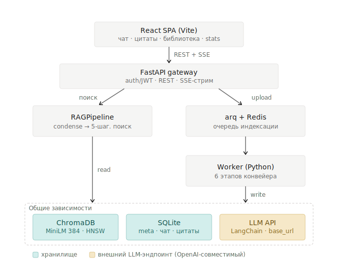

# Архитектура: RAG-система для научной литературы по лазерной наплавке (CladRAG)

> Спецификация для передачи агенту-разработчику. Эволюция системы из статьи
> Д.В. Малышев, М.Е. Соловьёв (ЯГТУ) — CLI заменяется веб-приложением,
> вся доменная/AI-логика остаётся на Python-бэкенде.

Версия: 1.0 · Дата: 2026-06-20

---

## 0. Диаграмма архитектуры



> Схема: [architecture-rag-laser-cladding.svg](architecture-rag-laser-cladding.svg).
> React SPA -> FastAPI gateway (REST + SSE); шлюз ведёт в RAGPipeline (поиск)
> и в очередь arq + Redis -> Worker (индексация). Оба пути используют общие
> зависимости: ChromaDB (MiniLM-384, HNSW), SQLite и внешний LLM-эндпоинт через LangChain.

---

## 1. Зафиксированные решения

| Тема | Решение |
|---|---|
| Масштаб | Одна компания сейчас; мультитенантность — заложить «швы», не реализовывать |
| Бэкенд | **FastAPI** (async), держит всю логику документов/AI/поиска |
| Фронтенд | **React SPA на Vite** — тонкий интерфейс общения с ассистентом |
| LLM-доступ | **LangChain + `ChatOpenAI`** с настраиваемым `base_url` (OpenAI / vLLM / llama.cpp / Ollama) |
| Эмбеддинги | **`all-MiniLM-L6-v2` (384), локально** через `sentence-transformers` (как в статье) |
| Стриминг | **SSE** (Server-Sent Events) |
| Очередь | **Redis + `arq`** (async-воркер индексации) |
| Векторная БД | **ChromaDB в режиме server** (HNSW), коллекция на тенанта |
| Реляционная БД | **SQLite** сейчас (за интерфейсом `DatabaseManager` → Postgres потом) |
| История чата | **Есть** — conversational RAG с переписыванием follow-up |

## 2. Принцип

7 модулей и оркестратор `RAGPipeline` из статьи переиспользуются **без изменений
доменной логики**. Веб-слой добавляет вокруг них четыре вещи, которых не было у CLI:

1. HTTP-слой (FastAPI) + стриминг ответа (SSE);
2. асинхронную индексацию (Redis + arq + worker) — загрузка документа 8–45 с;
3. сессии чата с историей (новые таблицы + history-aware retrieval);
4. аутентификацию (JWT, роли `reader` / `curator`).

## 3. Компоненты

### 3.1 Доменные модули (из статьи — порт без изменений)

| Модуль | Назначение |
|---|---|
| `TextExtractor` | PDF (PyPDF2), DOCX (python-docx), ODT (odfpy), TXT, MD; quality score 0.0–1.0; предупреждение при < 0.4 |
| `DocumentAnalyzer` | Тип по объёму (тезисы <2k, статьи 2k–25k, обзоры 25k–35k, монографии >35k слов), язык по символьному составу |
| `MetadataExtractor` | LLM → JSON (title, authors, abstract, keywords, DOI, URL, year, journal, ссылка). Статьи — быстрая модель, монографии — long-context, fallback на резервную (до 3 повторов) |
| `DocumentSplitter` | Фрагменты по границам абзацев: цель 800 слов, overlap 150 |
| `ChromaIndexer` | Эмбеддинг MiniLM-384, индекс HNSW, фильтрация по метаданным (тип/язык/название/авторы) |
| `DatabaseManager` | SQLite-таблицы `documents` / `citations` / `keywords`; атомарная транзакция с откатом |
| `RAGPipeline` | Оркестратор: режимы индексации и поиска+генерации |

### 3.2 Новые модули (веб-слой)

| Модуль | Назначение |
|---|---|
| `api/` (FastAPI) | REST-роутеры + SSE-эндпоинт чата + auth middleware |
| `llm/` | Обёртка LangChain: фабрика `ChatOpenAI` по задачам (gen/translate/metadata), fallback-цепочка |
| `queue/` (arq) | Постановка задач индексации в Redis, статусы job по этапам |
| `worker.py` | arq-воркер: гоняет те же 6 этапов конвейера в фоне |
| `chat/` | Conversational RAG: condense follow-up, окно контекста, persist истории |

### 3.3 Фронтенд (React SPA, Vite)

Экраны: **Чат** (главный), **Библиотека** (список + загрузка + статус индексации),
**Источник/цитаты** (панель сбоку), **Stats/Admin**.
Конвенции проекта: один компонент на файл, интерфейс пропсов `<Name>Props`.
Ключевой хук — `useSSEChat` (стрим токенов + событие citations).

## 4. Поток индексации (upload → 6 этапов)

```
POST /documents (multipart)
  └─ FastAPI: сохранить файл, создать doc(id), arq.enqueue(index_job) → 202 {job_id}
       └─ Worker (arq), 6 этапов; результат каждого = вход следующего (re-run с любого):
          1. TextExtractor   → нормализованный текст, SHA-256, quality_score
          2. DocumentAnalyzer→ тип + язык (влияют на split и приоритет поиска)
          3. MetadataExtractor→ первые 3000 слов → LLM → JSON (fallback ≤3, иначе по имени файла)
          4. DocumentSplitter → фрагменты 800 / overlap 150
          5. ChromaIndexer   → вектора + метаданные в ChromaDB (фильтруемый поиск без SQLite)
          6. DatabaseManager → атомарно в 3 таблицы SQLite; ошибка → rollback
  Фронт поллит GET /jobs/{job_id} → {stage 1..6, status, quality_score?, warning?}
  UI: прогресс по этапам + кнопка «Retry from stage N»
```
Тайминги (из статьи): статья 6–10 стр. — 8–18 с; монография 100–200 стр. — 15–45 с.

## 5. Поток запроса (conversational RAG + SSE)

```
POST /conversations/{id}/messages { query }
  0. CONDENSE — LLM переписывает follow-up + историю в самостоятельный запрос
               (LangChain history-aware retriever)   ← единственная новая логика
  --- далее 5 шагов поиска РОВНО как в статье -------------------------------
  1. детект языка по символьному составу
  2. перевод запроса на второй язык (LLM)
  3. раздельный поиск в ChromaDB по каждому языку (по 10 фрагм., min cos-distance)
  4. merge + dedup + ранжирование
  5. фрагменты + ИСХОДНЫЙ запрос + история → LLM → ответ с номерами источников
  6. библиографические ссылки из SQLite → пронумерованный список
```
Важно: в retrieval идёт **переписанный** запрос, в генерацию — **исходный + история**.
Окно контекста: последние N реплик (саммари старых при переполнении).
Тайминги: семантический поиск < 100 мс; полный ответ 3–10 с.

## 6. API-контракты

```
# Auth
POST /auth/login            → { access_token (JWT), role }

# Документы / индексация (async)
POST   /documents           (multipart)  → 202 { job_id, doc_id }
GET    /jobs/{job_id}        → { stage:1..6, stage_name, status, quality_score?, warning? }
GET    /documents           → [{ id, title, authors, year, type, lang, quality_score, chunks }]
GET    /documents/{id}/summary
DELETE /documents/{id}

# Чат (главный экран)
POST /conversations         → { conversation_id }
GET  /conversations/{id}     → история сообщений
POST /conversations/{id}/messages  { query, filters? }   → SSE-стрим (см. §7)

# Power-поиск (перенос CLI-команд)
POST /search                {query, filters}  → фрагменты   (= /search)
POST /search/metadata       {filters}          (= /searchmeta)
GET  /stats                                    (= /stats)
```

## 7. SSE-протокол `/conversations/{id}/messages`

```
event: status    data: {"stage":"retrieving"}
event: status    data: {"stage":"generating"}
event: token     data: {"text":"Оптим"}
event: token     data: {"text":"альные ..."}
event: citations data: [{"n":1,"doc_id":"...","title":"...","authors":[...],
                         "year":2025,"journal":"...","doi":"...","url":"...",
                         "chunk_ids":[...]}]
event: done      data: {"message_id":"..."}
```
Фронт: токены → пузырь ответа; `citations` → панель источников + кликабельные `[1][2]`.

## 8. Модель данных

### SQLite (реляционная)
```
documents     (id, tenant_id, sha256, title, authors, abstract, doi, url,
               year, journal, type, lang, quality_score, n_pages, n_words, created_at)
citations     (id, document_id, ...)            -- библиография для ответов
keywords      (id, document_id, keyword)
conversations (id, tenant_id, user_id, title, created_at)     -- НОВОЕ
messages      (id, conversation_id, role, content, citations_json, created_at)  -- НОВОЕ
```
`messages.citations_json` хранит привязку ответа к источникам → воспроизводимость старых диалогов.

### ChromaDB (векторная)
Коллекция `corpus_{tenant_id}`; запись = `(vector[384], metadata{type,lang,title,authors,doc_id,chunk_id})`.

## 9. Конфигурация (env)

```
# LLM (OpenAI-совместимый эндпоинт)
LLM_BASE_URL=...           LLM_API_KEY=...
MODEL_FAST=...             # генерация, перевод, метаданные статей
MODEL_LONG_CTX=...         # метаданные монографий
MODEL_FALLBACK=...         # резерв (до 3 повторов)
# Эмбеддинги (локально)
EMBED_MODEL=all-MiniLM-L6-v2
# Инфраструктура
CHROMA_HOST=...  CHROMA_PORT=...
REDIS_URL=redis://...
SQLITE_PATH=...            JWT_SECRET=...
CHAT_HISTORY_WINDOW=...    # N последних реплик в контекст
```

## 10. Развёртывание (docker-compose)

Сервисы: `frontend` (nginx со статикой Vite-сборки) · `api` (uvicorn FastAPI) ·
`worker` (arq) · `redis` · `chromadb` (server mode) · том для `SQLITE_PATH` и файлов ChromaDB.
`api` и `worker` делят один образ Python; масштабируются независимо.

## 11. Швы под мультитенантность (заложить сейчас)

- `tenant_id` в JWT и во всех записях БД (сейчас всегда один).
- ChromaDB — коллекция на тенанта (`corpus_{tenant_id}`).
- `DatabaseManager` и `ChromaIndexer` принимают `tenant_id` в сигнатуре.
- Redis pub/sub для SSE — на случай разнесения генерации и стрима по процессам.

## 12. Маппинг на roadmap статьи

| Пункт из статьи | Статус в этом дизайне |
|---|---|
| Веб-интерфейс | Реализуется (этот документ) |
| multilingual-e5-large | Отдельная задача: `Embedder` за интерфейсом, переиндексация. **v1 — MiniLM** |
| OCR для сканов | Будущий опциональный этап в `TextExtractor` (триггер `quality_score < 0.4`) |
| Мониторинг новых публикаций | Будущий cron-воркер: DOI/arXiv/Crossref → та же очередь индексации |

## 13. Не входит в v1 (non-goals)

- Мультитенантный рантайм (только швы).
- Postgres (остаётся SQLite).
- e5-large эмбеддинги, OCR, авто-мониторинг публикаций.
- Прерывание генерации на лету (SSE односторонний; при необходимости — WebSocket позже).
